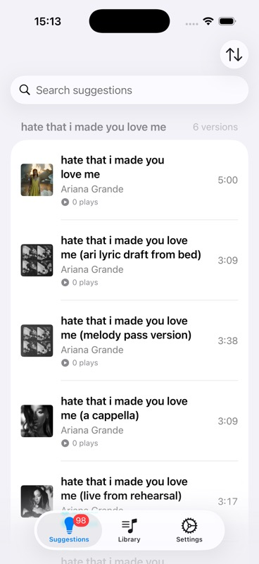

# MusicCount

**Repair split Apple Music play counts before cleaning up duplicate Library Songs**

SwiftUI · MediaPlayer · MusicKit · Swift Concurrency · Swift Testing · iOS 18.0+

[Download on the App Store](https://apps.apple.com/gb/app/musiccount/id6754639829)



_Captured from the `MusicLibraryVerification` scheme on an iPhone simulator with `-MockData`, `-ResetRepairState`, and an artwork-backed mock export._

---

## Product

MusicCount helps Apple Music users repair listening history that has been split across duplicate Library Songs. It scans the user's library on-device, groups possible duplicates by normalized title and artist, and surfaces Suggestions where the versions have different Play Counts.

The core workflow is Suggestions-first:

- Review a Suggestion for a Duplicate Group with a Play Count Gap.
- Choose the Canonical Song that should keep the listening history.
- Confirm which versions are Retired Songs.
- Build a Repair Queue that repeats the Canonical Song by the calculated Repair Amount.
- Follow through in Apple Music, then mark the Active Repair done in MusicCount.

MusicCount does not delete songs from the user's library and does not infer that a repair is complete. Retired Songs are collected in one app-owned Songs to Remove Playlist as a handoff checklist, and the user marks each Active Repair as a Completed Repair after the real-world cleanup is done.

The full Library Song browser is still available as a secondary surface for search, inspection, sorting, and manual queueing, but the primary path starts from Suggestions and repair decisions.

---

## Features

### Suggestions-First Repair

Suggestions are built from Duplicate Groups whose Library Songs share a normalized title and artist but have different Play Counts. The largest Play Count Gaps float to the top, so the app starts with the most valuable repair opportunities.

### Canonical Song Decisions

Each repair is framed around one Canonical Song and one or more Retired Songs. By default, every non-canonical Library Song in the Duplicate Group is treated as retired, with the option to exclude genuinely distinct versions.

### Repair Queue Creation

MusicCount calculates the Repair Amount from the included Retired Songs, then builds an Apple Music playback queue for the Canonical Song. When the queue is built, the Suggestion moves out of normal review and becomes an Active Repair.

### Active Repairs and Completed Repairs

Active Repairs keep track of the Canonical Song, Retired Songs, and Repair Amount while the user finishes the work outside the app. Repairs become Completed Repairs only when the user marks them done.

### Songs to Remove Playlist

Because MusicCount cannot remove Retired Songs from a user's Apple Music library, it maintains one app-owned Songs to Remove Playlist. The playlist contains Retired Songs from outstanding Active Repairs and is updated when repairs are completed.

### Search, Sorting, and Dismissals

Suggestions and Library Songs support search and sorting. Dismissals hide either an entire Suggestion or one Library Song inside a Suggestion, so known non-problems do not keep coming back.

---

## Architecture

The app target is intentionally thin: `MusicCount/MusicCountApp.swift` launches the Swift package feature module and switches to a debug-only physical library export view when requested.

Most product code lives in `MusicCountPackage/Sources/MusicCountFeature`:

- `MainTabView` wires Suggestions, Library, and Settings together with SwiftUI environment injection.
- `MusicLibraryService` loads real Library Songs through MediaPlayer; `MockMusicLibraryService` supports deterministic development and UI verification.
- `SuggestionsService` analyzes Duplicate Groups and persists Dismissals, Active Repairs, and Completed Repairs locally.
- `SuggestionRepairWorkflow` coordinates Repair Queue creation, Active Repair creation, and Songs to Remove Playlist sync.
- `AppleMusicQueueService` talks to the system music player.
- `SongsToRemovePlaylistService` owns the app-created playlist handoff through MusicKit.

The project uses SwiftUI's Observation model for app state, Swift Concurrency for async library and playlist work, and small service seams so repair rules can be tested without a live Apple Music library.

The product decisions behind the implementation are:

- Suggestions are the primary surface.
- Repairs happen at the Duplicate Group level.
- A repair has one Canonical Song and one or more Retired Songs.
- Queued Suggestions become Active Repairs.
- Repairs are marked done manually.
- The Songs to Remove Playlist is a single app-owned playlist.

---

## Run Locally

Requirements:

- Xcode with iOS 18.0+ SDK support.
- An available iPhone simulator.
- Apple Music library permission for real-library runs.

Open the workspace and run the shared scheme:

```sh
open MusicLibraryVerification.xcworkspace
```

In Xcode, select the `MusicLibraryVerification` scheme and an iPhone simulator, then run.

For deterministic mock data, add these launch arguments to the scheme:

```text
-MockData -ResetRepairState
```

Useful debug launch arguments:

```text
-MockData
-ResetRepairState
-MockActiveRepairs
-MockDataExportPath /path/to/LibrarySongExports/export-YYYYMMDD-HHMMSS
```

The Swift package imports iOS frameworks such as UIKit, MediaPlayer, and MusicKit, so host-only SwiftPM commands can fail before tests run. Use the Xcode workspace, scheme, and an iPhone simulator for normal verification.

---

## Verification

The `MusicLibraryVerification` test plan includes:

- `MusicCountFeatureTests` for model rules, Suggestion analysis, repair decisions, Repair Queue behavior, Songs to Remove Playlist sync behavior, export loading, and preview scenarios.
- `MusicCountUITests` for deterministic mock-data launch, Suggestions-first navigation, secondary Library Song manual queueing, search empty-state recovery, long Library Song text wrapping, Active Repair completion, and playlist retry behavior.

CLI check:

```sh
xcodebuild \
  -workspace MusicLibraryVerification.xcworkspace \
  -scheme MusicLibraryVerification \
  -configuration Debug \
  -destination 'platform=iOS Simulator,name=iPhone 17 Pro' \
  test
```

If that simulator is not installed, choose another available iPhone simulator and update the `-destination` value.

The README screenshot was produced from a successful simulator build and launch using the same workspace and scheme:

```text
MusicLibraryVerification · iPhone 17 Pro · -MockData -ResetRepairState -MockDataExportPath <export>
```

---

## What I Would Do Next

- #33 Add GitHub Actions PR verification for MusicCount.
- #34 Decide MusicCount's iPad support scope.
- #12 Decompose the architecture review findings into focused follow-up slices.

---

## Tech Stack

**UI:** SwiftUI

**Apple frameworks:** MediaPlayer, MusicKit

**Language:** Swift 6.1 package tools, Swift Concurrency

**State:** SwiftUI Observation, environment-injected services, local UserDefaults-backed repair state

**Testing:** Swift Testing plus XCTest UI tests through the `MusicLibraryVerification` scheme

**Dependencies:** No third-party runtime dependencies

---

## License

All rights reserved. This repository is public for portfolio purposes only.

---

## Links

[App Store](https://apps.apple.com/gb/app/musiccount/id6754639829) · [Portfolio](https://jacobrees.co.uk)
